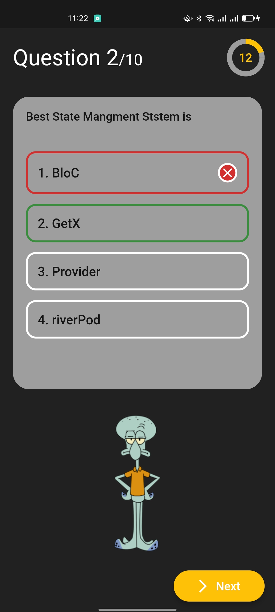
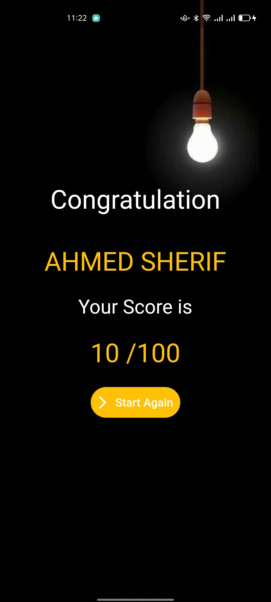
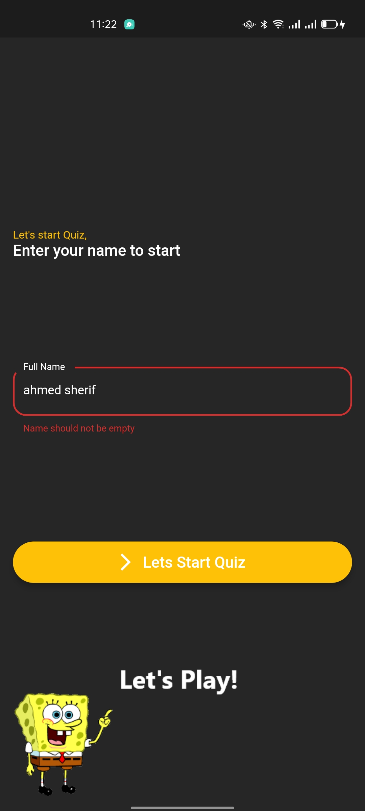

# Quiz App ✍🏻
Quiz App TimeController&GetX [MVC pattern] 👨🏻‍💻

Quiz app is open-source Quiz app for Android & ios. It is built with Dart on top of Google's Flutter Framework.

|   |   |
|   |   |
|   |   |
|   |   |
|   |  |
|  |  |
|  |  |
